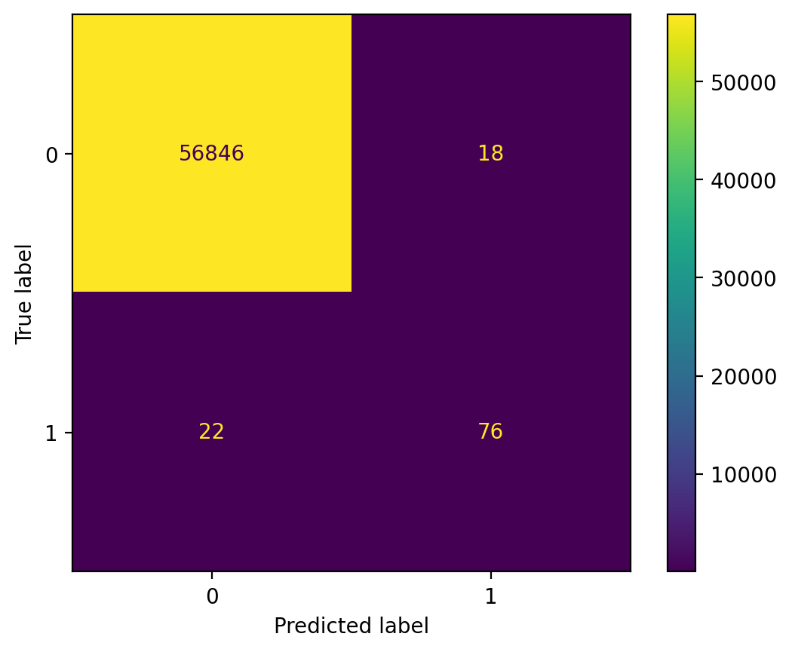
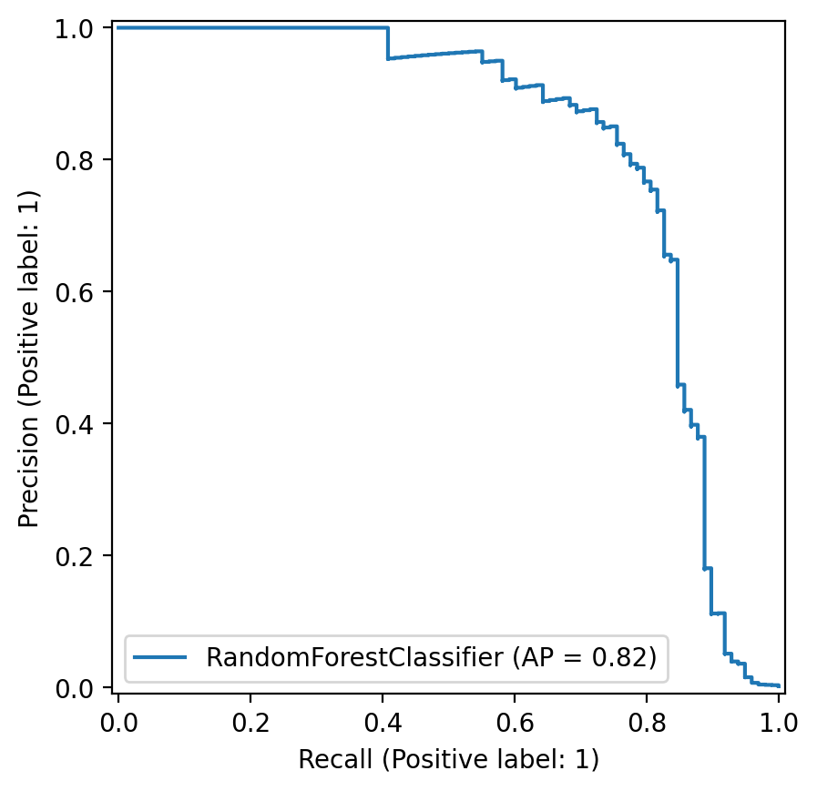
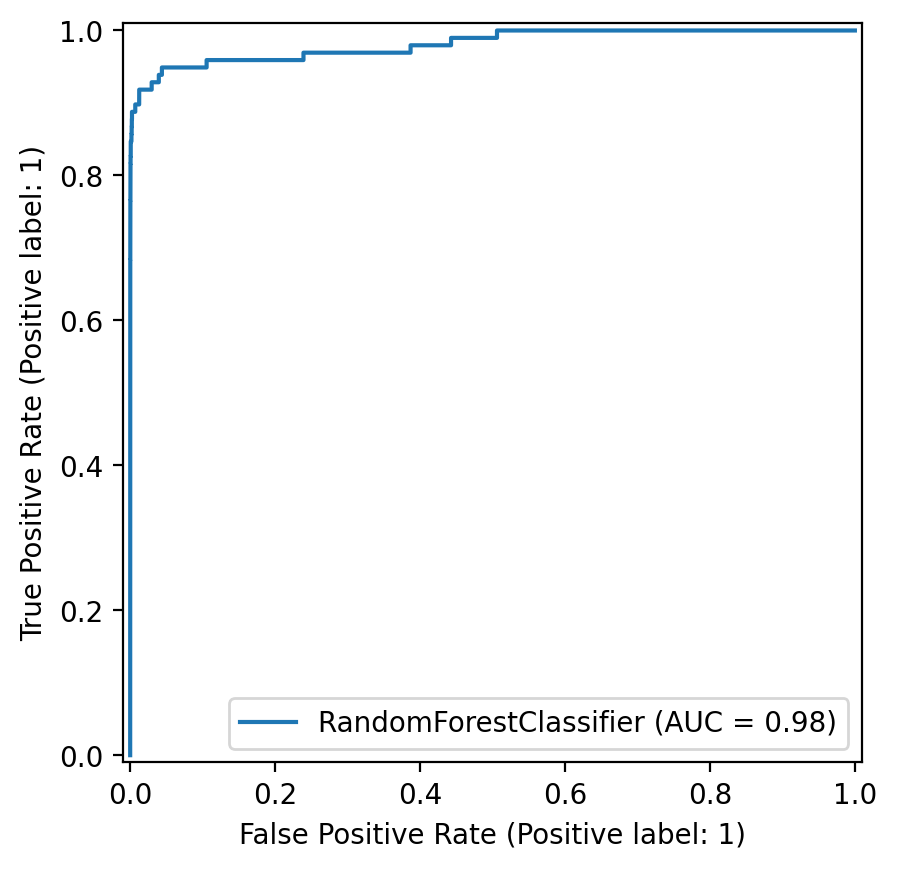

# Credit Card Fraud Detection

An end-to-end machine learning project for detecting fraudulent credit card transactions under extreme class imbalance.

This repository is designed as a portfolio-ready ML project for research applications, RA opportunities, and job search presentation. It focuses on practical modeling decisions for real-world fraud detection: imbalanced learning, threshold tuning, model comparison, reproducible evaluation, and readable project structure.

## Why This Project

Credit card fraud detection is a classic but still highly practical machine learning problem:

- the positive class is extremely rare
- accuracy alone is misleading
- recall and precision must be balanced carefully
- decision thresholds matter as much as model choice

This project treats fraud detection as a realistic imbalanced classification task rather than only a toy benchmark.

## Project Highlights

- Built a complete fraud detection pipeline from raw CSV to saved model artifact
- Compared `Logistic Regression` and `Random Forest` on a validation split
- Applied `SMOTE` to address class imbalance in the training set
- Tuned the classification threshold on the validation set instead of using a fixed `0.50`
- Evaluated the final model using `Precision`, `Recall`, `F1`, `ROC-AUC`, and `PR-AUC`
- Generated reusable reports and visualizations for GitHub presentation

## Dataset

Source:

`https://www.kaggle.com/datasets/mlg-ulb/creditcardfraud`

After downloading, place the dataset here:

```text
data/raw/creditcard.csv
```

The dataset contains anonymized PCA-based transaction features, transaction amount, and a binary fraud label:

- `Class = 0`: normal transaction
- `Class = 1`: fraudulent transaction

## Method

### Pipeline

1. Load and validate the raw transaction dataset
2. Split data into train, validation, and test sets with stratification
3. Standardize the `Amount` feature
4. Apply `SMOTE` on the training split only
5. Train multiple candidate models
6. Select the best model by validation `PR-AUC`
7. Tune the decision threshold on the validation set
8. Evaluate on the held-out test set
9. Save the selected model, threshold, and feature metadata

### Models Compared

- `LogisticRegression`
- `RandomForestClassifier`

### Why PR-AUC Matters Here

Because fraud cases are rare, `PR-AUC` is more informative than plain accuracy and often more practically meaningful than `ROC-AUC` alone. This project uses validation `PR-AUC` to choose the final model.

## Experimental Result

### Validation Leaderboard

| Model | Validation PR-AUC | Validation F1 | Validation Recall | Best Threshold |
|---|---:|---:|---:|---:|
| Random Forest | 0.7575 | 0.7801 | 0.6962 | 0.80 |
| Logistic Regression | 0.6801 | 0.3699 | 0.8101 | 0.95 |

### Final Test Performance

Selected model: `Random Forest`  
Selected threshold: `0.80`

| Metric | Value |
|---|---:|
| Fraud Precision | 0.8085 |
| Fraud Recall | 0.7755 |
| Fraud F1-score | 0.7917 |
| ROC-AUC | 0.9812 |
| PR-AUC | 0.8202 |

### Interpretation

- The model achieves strong separation performance with `ROC-AUC = 0.9812`
- `PR-AUC = 0.8202` indicates good fraud ranking quality under severe imbalance
- Fraud precision and recall are reasonably balanced after threshold tuning
- Random Forest clearly outperforms the logistic baseline on validation `PR-AUC`

## Visualizations

### Confusion Matrix



### Precision-Recall Curve



### ROC Curve



## Repository Structure

```text
credit-card-fraud-detection/
+-- data/
|   +-- raw/
|   |   +-- creditcard.csv
|   +-- processed/
+-- notebooks/
+-- src/
|   +-- data_preprocessing.py
|   +-- train.py
|   +-- evaluate.py
|   +-- predict.py
|   +-- utils.py
+-- models/
+-- outputs/
|   +-- figures/
|   +-- reports/
+-- requirements.txt
+-- .gitignore
+-- README.md
```

## How To Run

Install dependencies:

```bash
python -m pip install -r requirements.txt
```

Open the exploratory notebook if you want a compact data analysis walkthrough:

```bash
jupyter notebook notebooks/eda.ipynb
```

Train the model:

```bash
python src/train.py
```

Generate evaluation outputs:

```bash
python src/evaluate.py
```

## Output Files

After running the pipeline, the following outputs are generated:

- `models/fraud_model.pkl`
- `outputs/reports/training_report.txt`
- `outputs/reports/evaluation_summary.txt`
- `outputs/figures/confusion_matrix.png`
- `outputs/figures/pr_curve.png`
- `outputs/figures/roc_curve.png`
- `notebooks/eda.ipynb`

## Skills Demonstrated

- imbalanced classification
- validation-based model selection
- threshold optimization
- sklearn pipeline-style project organization
- experiment reporting and reproducibility
- GitHub-ready ML project presentation

## Future Work

- add `XGBoost` or `LightGBM` for stronger tabular performance
- add cross-validation and confidence intervals
- test cost-sensitive learning against SMOTE-based resampling
- add experiment tracking with MLflow or Weights & Biases
- package the model behind a small API or demo app
